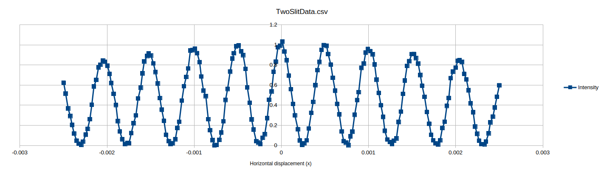
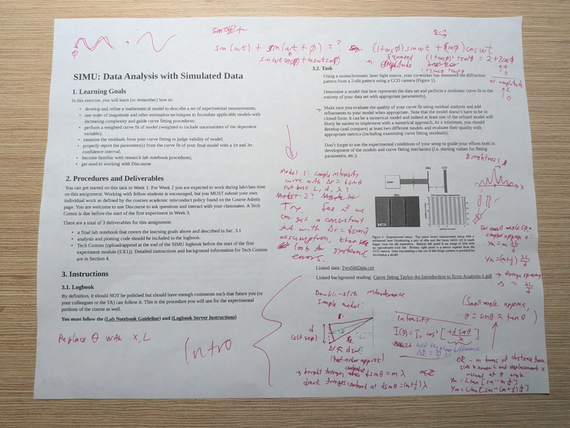
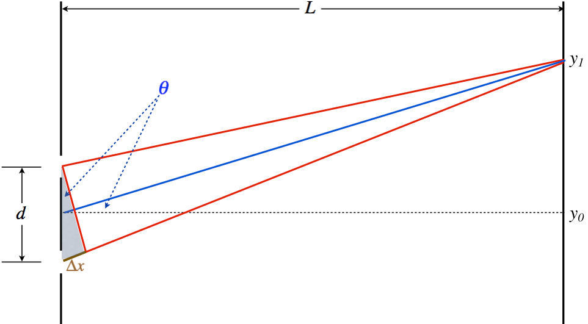
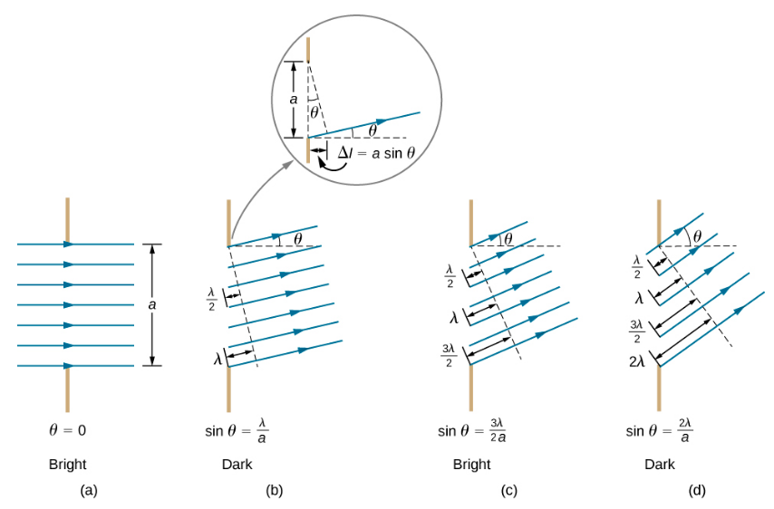
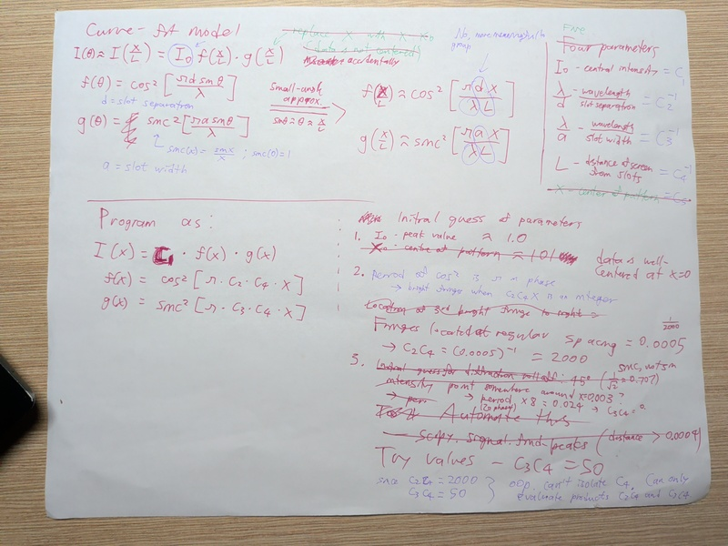
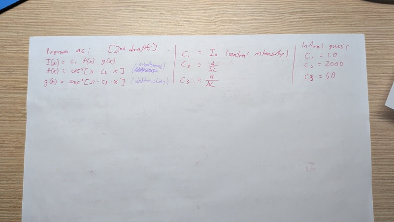
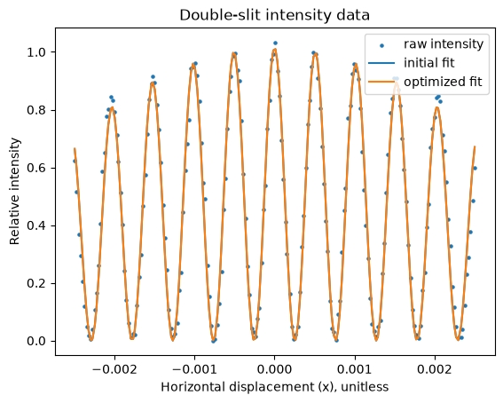
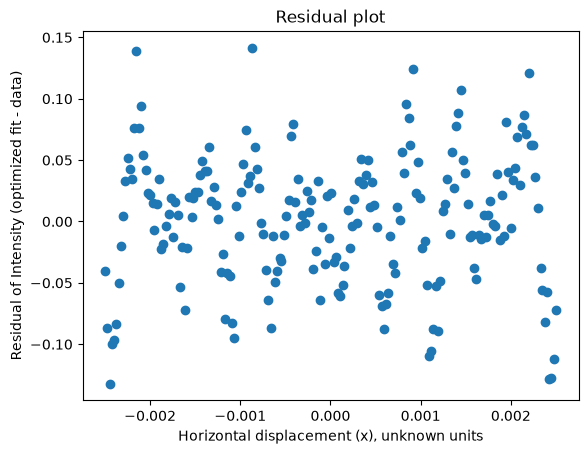

# 2026-09-17

## Introduction

>>>
**Goal**: Find a model and parameters for a best-quality curve fit to the brightness-versus-horizontal displacement data from a double-slit experiment, provided in `TwoSlitData.csv`. Evaluate the quality of the curve fit to the entirety of the dataset using residual analysis. 

**Approach**: The double-slit experiment is one we analyzed in first-year. For an ideal setup I can find analytical equations for the intensity curve versus horizontal displacement. I will first try fitting that simple model by searching the parameter space. If there remains systemic error, then I will think of adjustments to the model which could be motivated by nonidealities in the experimental setup which I do not consider at first.

**Ongoing/Potential issues/questions**: none, just started.

## Body

Plot of data:


### Description of the Physics

The lab assignment is about the Double-Slit Experiment which we learned about in first year. The two slits split the light into two in-phase point sources, which project onto a flat screen behind the slits. The light from the two slits reach the screen in-phase at the point halfway between the slits, having travelled the same distance. With horizontal displacement from the middle slit, the two lights go in and out of phase as the path difference increases, creating an interference pattern with alternating dark and bright fringes, to either side of the central bright fringe.

A page giving a description of the physics:
https://phys.libretexts.org/Courses/University_of_California_Davis/Physics_9B_Fall_2020_Taufour/03%3A_Physical_Optics/3.02%3A_Double-Slit_Interference
Archived at: https://web.archive.org/web/20260616130331/https://phys.libretexts.org/Courses/University_of_California_Davis/Physics_9B_Fall_2020_Taufour/03:_Physical_Optics/3.02:_Double-Slit_Interference




$$ \left . \begin{array}{l} I=I_o\cos^2\left(\dfrac{\Delta \Phi}{2}\right) \\ \Delta \Phi = \dfrac{2\pi}{\lambda}\Delta x \\ \Delta x = d\sin\theta \end{array} \right\rbrace \;\;\;\Rightarrow\;\;\; I\left(\theta\right) = I_o\cos^2\left[\dfrac{\pi d\sin\theta}{\lambda}\right] $$

Problem: this cosine-squared model fits the regularly spaced fast oscillation of intensity, but not the roll-off of the envelope. 

Q: what's the assumption on the radiation pattern from the slits? 
A: isotropic radiation. Check against diffraction model.

[Double-slit diffraction](https://phys.libretexts.org/Bookshelves/University_Physics/University_Physics_(OpenStax)/University_Physics_III_-_Optics_and_Modern_Physics_(OpenStax)/04%3A_Diffraction/4.04%3A_Double-Slit_Diffraction)

> The diffraction pattern of two slits of width that are separated by a distance d is the interference pattern of two point sources separated by d multiplied by the diffraction pattern of a slit of width

So, just multiply by the radiation pattern for single-slit diffraction. This will account for the rolloff. 

[Single-slit diffraction](https://phys.libretexts.org/Bookshelves/University_Physics/University_Physics_(OpenStax)/University_Physics_III_-_Optics_and_Modern_Physics_(OpenStax)/04%3A_Diffraction/4.02%3A_Single-Slit_Diffraction).



[Intensity of single-slit diffraction](https://phys.libretexts.org/Bookshelves/University_Physics/University_Physics_(OpenStax)/University_Physics_III_-_Optics_and_Modern_Physics_(OpenStax)/04%3A_Diffraction/4.03%3A_Intensity_in_Single-Slit_Diffraction)

Intensity vs angle for single-slit diffraction is given by Equation 4.3.5:
$$ I = I_0 \left(\dfrac{\sin \, \beta}{\beta}\right)^2 $$

$$\beta = \dfrac{\phi}{2} = \dfrac{\pi a \, \sin \, \theta}{\lambda} $$

Where $a$ is the slot width, and $\theta$ is the same viewing angle as for the double-slit experiment.

Finally, for small angles we can equate $\theta$ and $\frac xL$, where $L$ is the distance from the slots to the screen. L will become a scaling factor inside the function arguments.

### Approach to fitting

Upload the scratchwork where I wrote out my model curve fit later...



I determined the initial guesses by inspection. 
- The central intensity looks close to 1.
- The $\cos^2$ term associated with interference gives the bright fringes so I can use the fringe spacing (corresponding to $\pi$ phase) to estimate $c_2$.
- The $\textrm{sinc}^2$ term associated with slit diffraction gives the envelope of the bright fringes, so I just plotted a squared sinc function for different guesses of $c_2$, iterated by binary search, until I found a close-fitting one.

The curve-fit function $f(x)$ and optimization code is:
```python
def f(x, c1, c2, c3):
    return c1 * np.cos(pi*c2*x)**2 * np.sinc(pi*c3*x)**2

c1_start, c2_start, c3_start = 1., 2000., 50.
popt, pcov = optim.curve_fit(f, 
                             xdata=x, 
                             ydata=intensity, 
                             p0=[c1_start, c2_start, c3_start])
c1, c2, c3 = popt
```





| Fit Parameter | Interpretation | Initial Guess | Final Value |
| --- | --- | --- | --- |
| $c_1$ | $I_o$ | 1.0 | np.float64(1.014313880975543) |
| $c_2$ | $d / \lambda L$ | 2000 | np.float64(1965.8405907950653) |
| $c_3$ | $a / \lambda L$ | 50 | np.float64(40.48358241296144) |

The MSE of the initial guess fit was 0.010716563353330395

The MSE of the optimized fit was 0.0027574262777961918

### Commentary on the fit
The curve fit closely follows the data, so I am pretty confident that the physics-informed model which I proposed was a good model for the data. It would be a big coincidence otherwise.

There remains small error which shows itself most clearly at the clusters of points on the left and right fourth bright fringes. I asked Prof. El Bagghari about the error, and he replied that it's likely due to imperfections in how the slot was machined, and that no other student has been able to get a substantially closer fit to the entire dataset.

### Next steps
What to do with the uncertainty in x field of the measurement data? scipy.optim.curve_fit knows what to do with uncertainties in y, but not in x. Because I did not provide any uncertainties, the squared residual from all points was weighted equally, which wouldn't be right to do if some x-measurements might have been far from their true values.

Ans: the document *Curve fitting Taylor-An Introduction to Error Analysis-1* describes for a linear fit how to weight uncertainty in x or in both x and y. I should think on whether this procedure can be translated to some classes of nonlinear curve fit.

## Reflection
>>>
**Summary**: I found the model and parameter values for a curve fit which closely followed the data. Deriving the model from the physical laws which should apply to the test setup gave me the working model on the first go. I think this physics-informed approach is a good one to keep following for future, more complicated physics experiments.

**Next Steps**: The document *Curve fitting Taylor-An Introduction to Error Analysis-1* describes for a linear fit how to weight uncertainty in x or in both x and y. I should think on whether this procedure can be translated to some classes of nonlinear curve fit, and if so then incorporate the _uncertainty in x_ field into the curve fit optimization.

**Outstanding questions**: As described in, and to be answered as part of Next Steps.

